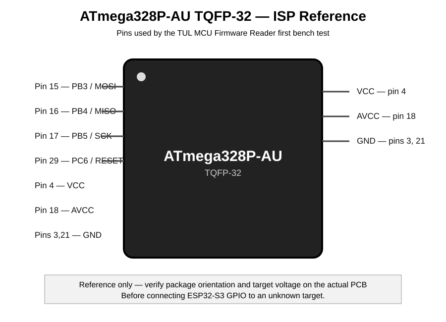
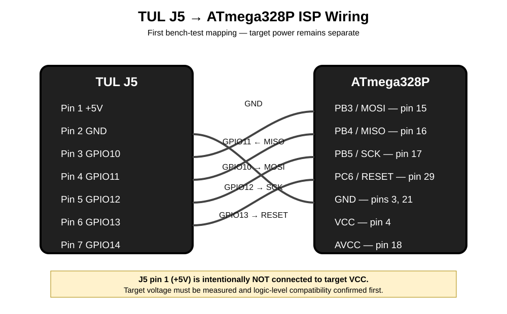

# ATmega328P ISP Proof of Concept

## Target

ATmega328P-AU, TQFP-32, installed on the hand-built logic-probe/test instrument supplied for bench testing.



## Target ISP pins

| ATmega328P function | TQFP-32 pin |
|---|---:|
| MOSI / PB3 | 15 |
| MISO / PB4 | 16 |
| SCK / PB5 | 17 |
| RESET / PC6 | 29 |
| VCC | 4 |
| AVCC | 18 |
| GND | 3, 21 |

## Proposed TUL J5 mapping for the first bench test

| J5 pin | ESP32-S3 GPIO | ISP role |
|---:|---:|---|
| 3 | GPIO10 | MOSI |
| 4 | GPIO11 | MISO |
| 5 | GPIO12 | SCK |
| 6 | GPIO13 | RESET |
| 7 | GPIO14 | Reserved |
| 8 | GPIO21 | Reserved |
| 2 | GND | Target GND |



J5 pin 1 (+5V) is deliberately not assigned to target VCC in this proof-of-concept.

## Electrical rule

The target supply voltage must be measured before connection. The first firmware test assumes a 3.3 V-safe target interface. If the target is powered at 5 V, do not connect ESP32-S3 outputs directly to MOSI, SCK, or RESET; use appropriate level shifting.

MISO must also be level-safe for the ESP32-S3 input.

## Bench measurements

Initial measurements recorded on the physical target:

| Measurement | Observed |
|---|---:|
| Target VCC | ~3.2 V |
| ATmega328P AVCC, pin 18 | 3.04 V |
| RESET, normal state | ~2.8 V |

Detailed and future measurements are recorded in [bench-log.md](bench-log.md).

## First test

The firmware will perform only:

1. Enter AVR programming mode.
2. Send the signature-read command.
3. Read three signature bytes.
4. Compare against `1E 95 0F`.
5. Report the result over serial.

No erase, write, fuse modification, or lock-bit modification is performed.

## Success criterion

```text
ATmega328P signature: 1E 95 0F
TARGET OK
```

If the signature is not correct, stop and diagnose wiring, RESET behavior, target voltage, clock, and ISP timing before adding Flash-read functionality.

## Real photographs

Actual photographs of the target PCB, component locations, J5 wiring, and the completed enclosure will be added later under [photos/](photos/). The reference diagrams above are documentation graphics, not photographs of the physical board.
